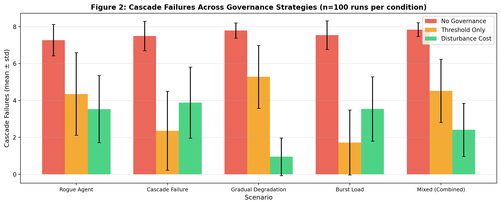
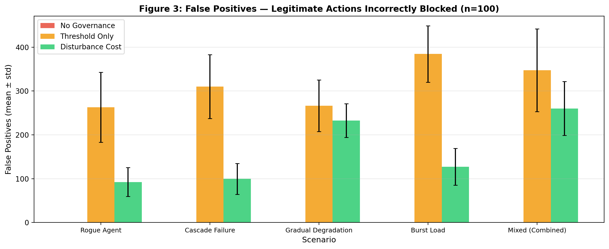
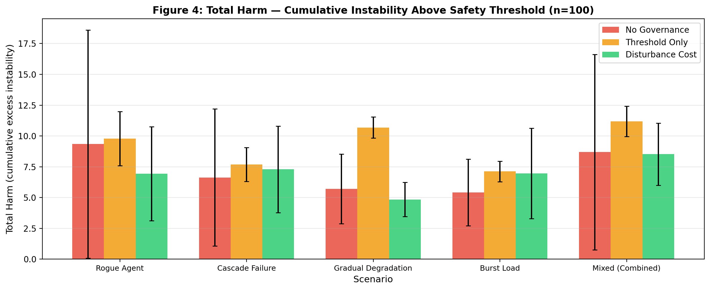
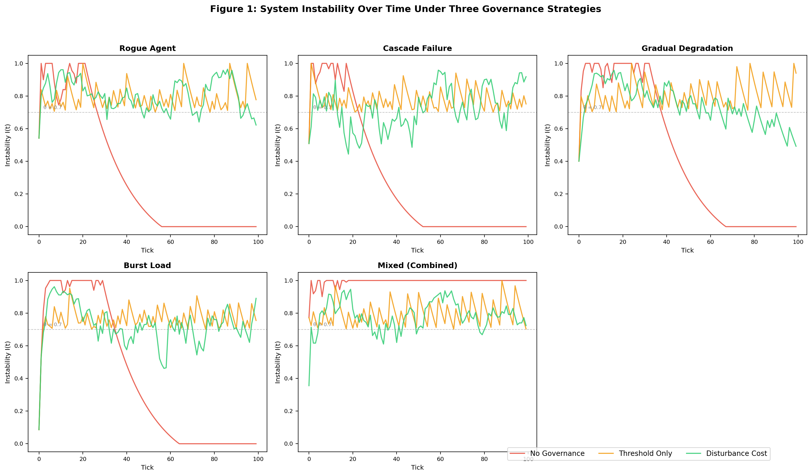
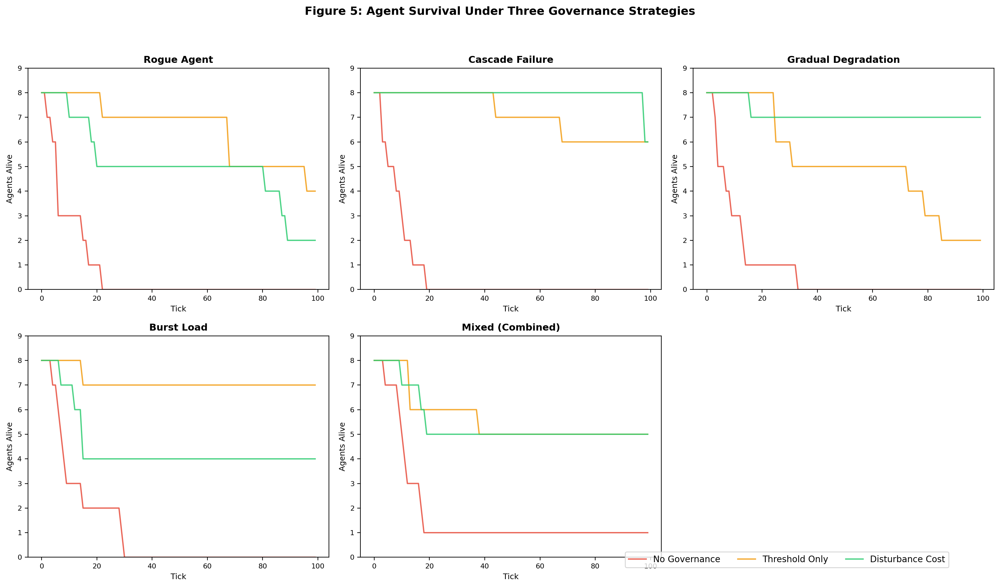

# West-OS: Behavioral Governance for Multi-Agent Systems

**Disturbance Cost — a systems primitive that meters consequence, not compute.**

[](./west_os_paper_v2.pdf)
[](./benchmark.py)
[](#license)

---

## What is this?

Every existing AI infrastructure primitive measures cost to the **machine** — CPU time, RAM, tokens, bandwidth.

None of them measure cost to the **system's coherence**.

**Disturbance cost** is a new primitive that measures how expensive an agent's action is to system stability — not how much compute it uses. It considers five factors:

- **Impact** — how much instability does this action cause?
- **System state** — is the system already stressed?
- **Recovery pressure** — has the system absorbed recent actions?
- **Actor reliability** — how trustworthy is the agent doing this?
- **Action type** — is this healing or harmful?

The same action by the same agent can have wildly different costs depending on *when* it happens. A safe action in a stable system costs almost nothing. The same action in an already-stressed system could trigger a cascade.

## Why does this matter?

Multi-agent AI systems don't fail from compute exhaustion. They fail from **behavioral cascades**: one agent destabilizes others, triggering chain reactions no individual agent intended.

Existing governance approaches either:
- **Filter content** (check what agents *say*) — misses behavioral cascades entirely
- **Set hard thresholds** (block everything above instability 0.7) — our benchmark proves this actually causes MORE harm than no governance in 4/5 scenarios, because it blocks healing actions along with harmful ones

Disturbance cost is the third option.

## Benchmark Results

**1,500 simulations. 5 failure scenarios. 3 governance strategies. 8 heterogeneous agents. 100 runs per condition.**

| Metric | No Governance | Threshold Only | Disturbance Cost |
|--------|:---:|:---:|:---:|
| **Cascade Failures** | 7.54 | 3.61 | **2.88** |
| **False Positives** | 0 | 319.6 | **160.5** |
| **Total Harm** | 6.54 | **9.18** ← worse! | 6.71 |

### Key findings:

- **48-82% fewer cascade failures** than no governance
- **50% fewer false positives** than threshold governance
- **Threshold governance produces MORE total harm than no governance** in 4/5 scenarios because it blocks restorative actions indiscriminately
- **Gradual degradation** (the most realistic scenario) shows the clearest win: disturbance cost reduces cascades to 1.42 vs 7.69 for no governance — an **82% reduction**

### Per-scenario cascade failures (mean ± std, n=100):

| Scenario | No Gov. | Threshold | Dist. Cost | Improvement |
|----------|:---:|:---:|:---:|:---:|
| Rogue Agent | 7.37 ± 0.91 | 4.23 ± 2.17 | **3.20 ± 1.90** | 57% |
| Cascade Failure | 7.36 ± 0.88 | 2.12 ± 2.21 | **3.28 ± 1.85** | 55% |
| Gradual Degradation | 7.69 ± 0.47 | 5.30 ± 1.61 | **1.42 ± 1.42** | 82% |
| Burst Load | 7.43 ± 0.98 | 1.56 ± 1.72 | **3.85 ± 1.98** | 48% |
| Mixed (Combined) | 7.83 ± 0.38 | 4.85 ± 1.67 | **2.67 ± 1.48** | 66% |

## Formal Framework

### The Formula

```
D(a, S(t)) = |impact| × (1 + pressure) × w(type) / reliability × (1 + instability)
```

Where `w` maps action types to weights: safe=0.5, standard=1.0, hazardous=2.0, restorative=0.3.

### Axioms

1. **Monotonicity** — Higher impact → higher cost
2. **State Sensitivity** — Same action costs more in a stressed system
3. **Actor Awareness** — Less reliable agents incur higher cost
4. **Type Differentiation** — Healing is cheaper than harm
5. **Pressure Accumulation** — Rapid sequences face increasing cost

### Governance Strategy

```
Budget B(t) = 1 - I(t)
DEFER if D(action) > B(t)
ALLOW otherwise
```

As instability rises, the budget shrinks. Only low-cost actions (safe, reliable, restorative) pass through during stress. This creates a natural attractor toward stability — analogous to a Lyapunov function in control theory.

### Connections to Established Theory

- **Control theory**: Disturbance cost as Lyapunov-like function
- **Economics**: Disturbance cost as externality price (like a carbon tax for AI behavior)
- **Queueing theory**: Recovery pressure as backpressure mechanism

## Architecture (Overview)

West-OS is a 14-service system with three layers plus biological and self-evolution subsystems:

| Layer | Services | Function |
|-------|----------|----------|
| **Perception** (6) | Independent analysis engines | Multi-angle detection |
| **Analysis** (4) | Router, Memory, Ledger, Convergence | Routing, state, audit, agreement detection |
| **Governance** (2 + governor) | Evidence, Pattern Mining, Governor | Evidence packets, rule proposals, authorization |
| **Biological** (1) | Mycelium (spores, chemotropism, anastomosis) | Temporal memory, gradient learning, trusted fusion |
| **Evolution** (1) | CHIMERA | Self-evolving capability generation |

### Key capabilities:
- **Convergence detection**: 3+ independent engines flag the same entity → auto-DEFER + evidence generation
- **Hash-chained event bus**: Tamper-proof audit trail (SHA-256)
- **Adaptive thresholds**: Learn from outcomes (adjusted 0.70→0.68, 0.90→0.88 autonomously)
- **Biological memory**: High-instability events stored as spores, re-processed when system recovers
- **Self-evolution**: System generates new analysis capabilities at runtime when needed
- **Progressive caution**: System gets MORE sensitive as it matures, not less

### Novel contributions not found in existing literature:
- **Behavioral cost metering** (vs compute metering)
- **Fungal network topology** for temporal memory and signal fusion
- **Emergence dynamics** with irreversible entropy
- **Self-evolving perception layer**

## Reproduce the Benchmark

```bash
# Clone this repo
git clone https://github.com/jennaleighwilder/west-os-benchmark.git
cd west-os-benchmark

# Run all 1,500 simulations (takes ~10 seconds)
python3 benchmark.py

# Results printed to console + saved to benchmark_results.json
```

Requirements: Python 3.8+, no external dependencies. The benchmark is self-contained.

Optional — generate figures:
```bash
pip install matplotlib numpy
python3 generate_figures.py
# Produces fig1-fig5 as PNG files
```

## Figures

### Cascade Failures Across Governance Strategies


### False Positives — Legitimate Actions Incorrectly Blocked


### Total Harm — Cumulative Instability Above Safety Threshold


### System Instability Over Time


### Agent Survival


## Paper

The full paper is available at [west_os_paper_v2.pdf](./west_os_paper_v2.pdf).

**Citation:**
```bibtex
@article{west2026disturbance,
  title={Disturbance Cost: Behavioral Governance with Biological Intelligence for Multi-Agent Systems},
  author={West, Jennifer Leigh},
  year={2026},
  institution={The Forgotten Code Research Institute}
}
```

## Related Work

| System | What it does | What it doesn't do |
|--------|-------------|-------------------|
| GaaS (2025) | Content filtering with trust scores | No behavioral cost metering |
| AGENTSAFE (2025) | Ethical assurance agents | No state-aware action gating |
| TRiSM (2025) | Trust/risk lifecycle management | No real-time cost computation |
| SAGA (2025) | Access control architecture | No consequence metering |
| **West-OS** | **Behavioral cost metering + biological intelligence** | **This work** |

## Author

**Jennifer Leigh West**
The Forgotten Code Research Institute
Rural Tennessee, United States

Independent AI researcher. No formal computer science background. This work emerged from 14 months of intensive pattern recognition applied to AI behavioral dynamics.

- Email: theforgottencode780@gmail.com
- Mirror Protocol™ — U.S. Copyright Registration No. 1-14949237971

## License

- **Benchmark code** (`benchmark.py`, `generate_figures.py`): MIT License — use freely, cite the paper
- **West-OS implementation**: Proprietary. Copyright © 2025-2026 Jennifer Leigh West. All rights reserved.
- **Paper**: CC BY 4.0

The benchmark is open so anyone can verify the results. The implementation is proprietary.
